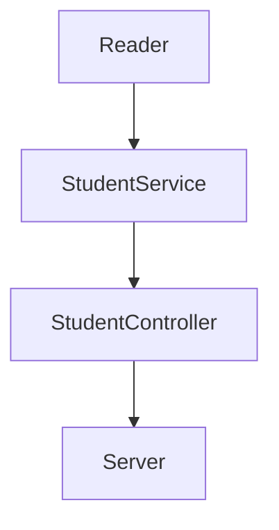
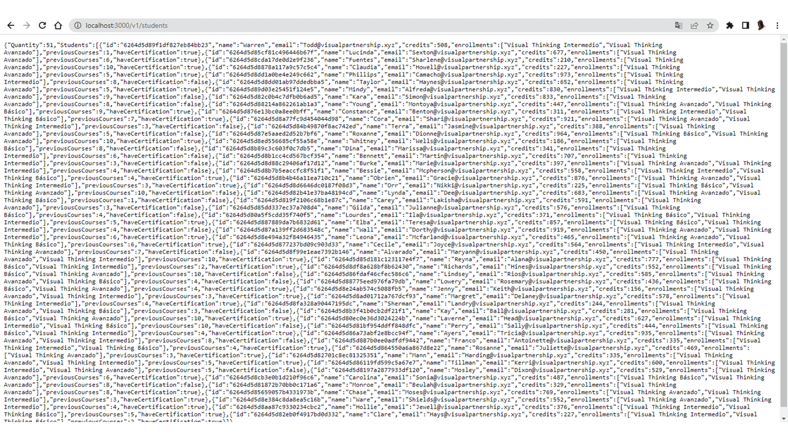
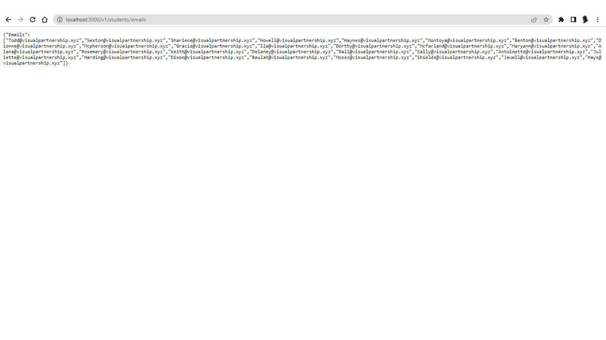
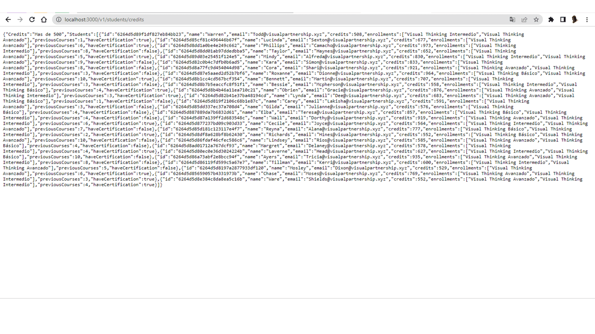

# Code_Challenge
Creación de una API de los estudiantes de VIsual Partner Ship.

## Dependencias
Las dependencias utilizadas para este proyecto son:

| Nombre  | Versión | Documentación | 
| :------------: | :------------: | :------------: |
| Jest | 27.5.1  |  |
| Express | 4.18.1 |  |
| ESLint | 8.14.0 |  |
- **Jest**: La versión más actual no es compatible con el workflow de GitHub Actions, por lo que se optó usar la version 27.5.1.
- **Express**: Las versiones anteriores express las considera obsoletas por lo que es necesario usar la más actual.
- **ESLint**: La versión más reciente tiene funcionalidades para mejor formateo de código.

## Componetes

+ **Reader:** Se encarga de leer un archvio y analizarlo como JSON, transformando el valor producido por el análisis.
+ **StudentService:** Almacena todas las funciones o metodos necesarios para realizar los requerimientos (Regresar una lista, filtrar por certificado, filtrar por creditos).
+ **StudentController:** Llama a los metodos que utiliza el*StudenService* para aplicarlos a la base de datos del *Reader*.
+ **Server:** Nos ayuda a exponer e interconectar nuestra aplicación.

## ¿Cómo funciona esta API?
Una API (interfaz de programación de aplicaciones) es un contrato que permite a los desarrolladores interactuar con una aplicación a través de un conjunto de interfaces. En este caso, la aplicación es una base de datos de objetos de estudiates de VIsual Partner Ship y cada uno contiene:
- Nombre
- ID
- Email
- Creditos
- Inscripciones
- Cursos previos
- Certificación

Las rutas que podemos consultar una vez activamos el server podemos verlas en el archivo [server.js](https://github.com/iRetr0o/Code_Challenge/blob/main/lib/server.js):
##### Ruta para consultar todos los estudiantes

    localhost:3000/v1/students

Nos regresa:

##### Ruta para consultar los emails de los estudiantes que tienen certificado

localhost:3000/v1/students/emails

Nos regresa:

##### Ruta para consultar los estudiantes que tienen más de 500 creditos

localhost:3000/v1/students/credits

Nos regresa:

En resumen:

