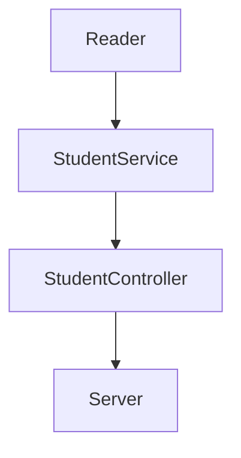

# Code_Challenge
Creación de una API de los estudiantes de VIsual Partner Ship (Practica 5 Launch X)

## Dependencias
Las dependencias utilizadas para este proyecto son:

| Nombre  | Versión | Documentación | 
| :------------: | :------------: | :------------: |
| Jest | 27.5.1  |   |
| Express | 4.18.1 |   |
| ESLint | 8.14.0 |   |

## Componetes

+ **Reader:** Se encarga de leer un archvio y analizarlo como JSON, transformando el valor producido por el análisis.
+ **StudentService:** Almacena todas las funciones o metodos necesarios para realizar los requerimientos (Regresar una lista, filtrar por certificado, filtrar por creditos).
+ **StudentController:** Llama a los metodos que utiliza el*StudenService* para aplicarlos a la base de datos del *Reader*.
+ **Server:** Nos ayuda a exponer e interconectar nuestra aplicación.

## Cómo funciona esta API?
Una API (interfaz de programación de aplicaciones) es un contrato que permite a los desarrolladores interactuar con una aplicación a través de un conjunto de interfaces. En este caso, la aplicación es una base de datos de objetos de estudiates de VIsual Partner Ship y cada uno contiene:
- Nombre
- ID
- Email
- Creditos
- Inscripciones
- Cursos previos
- Certificación

El archivo llamado [server.js](https://github.com/iRetr0o/Code_Challenge/blob/main/lib/server.js) contiene las rutas que podemos utilizar:
###### Ruta para consultar todos los estudiantes

localhost:3000/v1/students

Nos regresa:
(imagen)

###### Ruta para consultar los emails de los estudiantes que tienen certificado

localhost:3000/v1/students/emails

Nos regresa:
(imagen)

###### Ruta para consultar los estudiantes que tienen más de 500 creditos

localhost:3000/v1/students/credits

Nos regresa:
(imagen)

